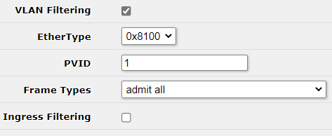
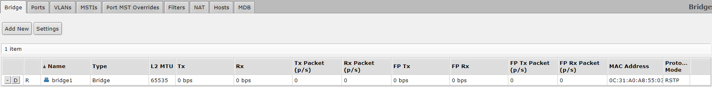
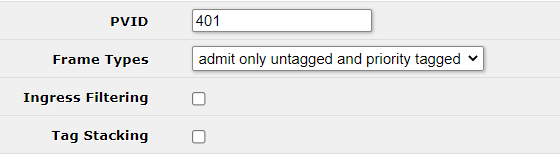
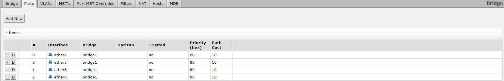
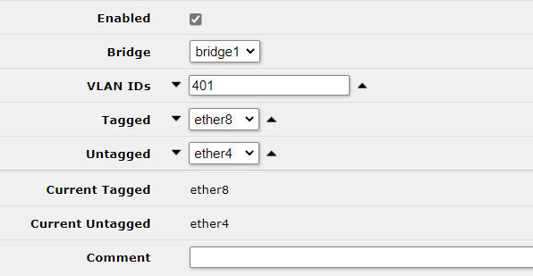
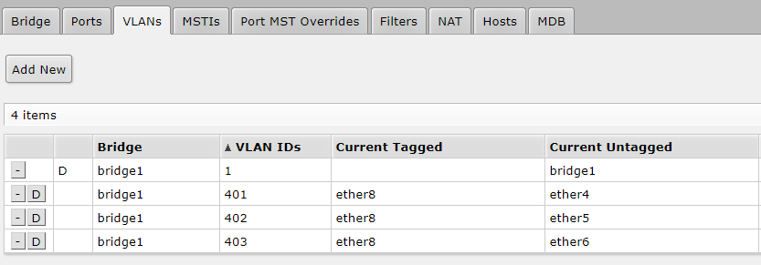
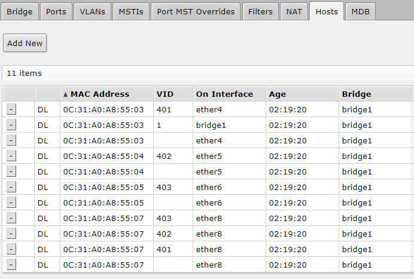

# Übung_03

## Aufgabenstellung

- Netzwerk Nach Abbildung im GNS3 nachbauen

- Definieren Sie für jede Abteilung eine VLAN Nummer (VLAN-ID) nach [folgendem Shema](#Parameter)

- Definieren Sie für jedes Gerät in den VLANS eine IP-Addresse im gleichen Subnetz.
- Richten Sie die VLANs auf beiden Switches ein
- Führen Sie tests durch um sicherzustellen dass sich nur Geräte aus dem selben VLAN erreichen können.
- Führen Sie auf dem Trunk einen "package capture" aus und analysieren Sie die einzelnen Ethernet Frames

## Ziele

- Auf beiden Switches sind die drei VLANs konfiguriert.

- Die beiden Switches sind über eine Trunk Leitung miteinander verbunden.

- Alle Pings können korrekt ausgeführt werden (im selbern VLAN).

- VLAN Tag mit Wireshark für alle drei VLANs nachgewiesen.

## Parameter

| Subnetz          | 192.168.23.0/24                  |
| ---------------- | :------------------------------- |
| VLAN Buchhaltung | Gruppennummer 4 * 100 + 1  = 401 |
| VLAN Entwicklung | Gruppennummer 4 * 100 + 2  = 402 |
| VLAN Verkauf     | Gruppennummer 4 * 100 + 3  = 403 |

### SW1

| Port   | VLAN ID(s)    | Tagged / Untagged |
| ------ | ------------- | ----------------- |
| ether4 | 401           | Untagged          |
| ether5 | 402           | Untagged          |
| ether6 | 403           | Untegged          |
| ether8 | 401, 402, 403 | Tagged            |

### SW2

| Port   | VLAN ID(s)    | Tagged / Untagged |
| ------ | ------------- | ----------------- |
| ether4 | 401           | Untagged          |
| ether5 | 402           | Untagged          |
| ether6 | 403           | Untegged          |
| ether8 | 401, 402, 403 | Tagged            |

### VPCs

| Name     | Interface | IP-Adresse | VLAN |
| -------- | --------- | ---------- | ---- |
| Net1_PC1 | e0        |            |      |
| Net1_PC2 | e0        |            |      |
| Net2_PC1 | e0        |            |      |
| Net2_PC2 | e0        |            |      |
| Net3_PC1 | e0        |            |      |
| Net3_PC2 | e0        |            |      |

## Aufgaben

### Konfiguration VLANs

Da der Ablauf der Konfiguration der VLANs auf beiden Switches der selbe ist, haben wird der Prozess nur einmal dokumentiert.

#### Bridge

Als erstes mussten wir eine Bridge für die verlangten Ports erstellen:

Webfig > Bridge > Bridge > Add New

Wichtig!! Unter VLAN muss VLAN Filtering eingeschaltet werden:

#### Ports

Webfig > Bridge > Ports > Add New

Anschliessend müssen die Ports der [Parameter Tabelle](#Parameter) entsprechend angefügt werden.

Wichtig!! Unter VLAN muss die dem Interface entsprechende VLAN ID bzw. PVID und Tagged oder Untagged eingetragen werden:

#### VLANs

Webfig > Bridge > VLANs> Add New

Die VLANs werden immer Port zu VPC Untagged zu Trunkport Tagged mit der entsprechenden VLAN ID:

#### Überprüfung

Anschliessend kann die Konfiguration unter Webfig > Bridge > Hosts überprüft werden:

### IPs auf den VPCs

Anschliessend mussten noch Statische IP-Adressen für die VPCs gesetzt werden (Siehe [Parameter](#Parameter)).
