# Übung_03

## Aufgabenstellung

- Netzwerk Nach Abbildung im GNS3 nachbauen

- Definieren Sie für jede Abteilung eine VLAN Nummer (VLAN-ID) nach [folgendem Shema](#Parameter)

- Definieren Sie für jedes Gerät in den VLANS eine IP-Addresse im gleichen Subnetz.
- Richten Sie die VLANs auf beiden Switches ein
- Führen Sie tests durch um sicherzustellen dass sich nur Geräte aus dem selben VLAN erreichen können.
- Führen Sie auf dem Trunk einen "package capture" aus und analysieren Sie die einzelnen Ethernet Frames

## Ziele

- Auf beiden Switches sind die drei VLANs konfiguriert.

- Die beiden Switches sind über eine Trunk Leitung miteinander verbunden.

- Alle Pings können korrekt ausgeführt werden (im selbern VLAN).

- VLAN Tag mit Wireshark für alle drei VLANs nachgewiesen.


## Parameter

| Subnetz          | 192.168.23.0/24                  |
| ---------------- | :------------------------------- |
| VLAN Buchhaltung | Gruppennummer 4 * 100 + 1  = 401 |
| VLAN Entwicklung | Gruppennummer 4 * 100 + 2  = 402 |
| VLAN Verkauf     | Gruppennummer 4 * 100 + 3  = 403 |

### SW1

| Port   | VLAN ID(s)    | Tagged / Untagged |
| ------ | ------------- | ----------------- |
| ether4 | 401           | Untagged          |
| ether5 | 402           | Untagged          |
| ether6 | 403           | Untegged          |
| ether8 | 401, 402, 403 | Tagged            |

### SW2

| Port   | VLAN ID(s)    | Tagged / Untagged |
| ------ | ------------- | ----------------- |
| ether4 | 401           | Untagged          |
| ether5 | 402           | Untagged          |
| ether6 | 403           | Untegged          |
| ether8 | 401, 402, 403 | Tagged            |

### VPCs

| Name     | Interface | IP-Adresse      | VLAN              |
| -------- | --------- | --------------- | ----------------- |
| Net1_PC1 | e0        | 192.168.69.2/24 | Buchhaltung (401) |
| Net1_PC2 | e0        | 192.168.69.5/24 | Buchhaltung (401) |
| Net2_PC1 | e0        | 192.168.69.3/24 | Entwicklung (402) |
| Net2_PC2 | e0        | 192.168.69.6/24 | Entwicklung (402) |
| Net3_PC1 | e0        | 192.168.69.4/24 | Verkauf (403)     |
| Net3_PC2 | e0        | 192.168.69.7/24 | Verkauf (403)     |

## Aufgaben


### Konfiguration VLANs

Da der Ablauf der Konfiguration der VLANs auf beiden Switches der selbe ist, haben wird der Prozess nur einmal dokumentiert.


#### Bridge

Als erstes mussten wir eine Bridge für die verlangten Ports erstellen:

Webfig > Bridge > Bridge > Add New

Wichtig!! Unter VLAN muss VLAN Filtering eingeschaltet werden:


#### Ports

Webfig > Bridge > Ports > Add New

Anschliessend müssen die Ports der [Parameter Tabelle](#Parameter) entsprechend angefügt werden.

Wichtig!! Unter VLAN muss die dem Interface entsprechende VLAN ID bzw. PVID und Tagged oder Untagged eingetragen werden:


#### VLANs

Webfig > Bridge > VLANs> Add New

Die VLANs werden immer Port zu VPC Untagged zu Trunkport Tagged mit der entsprechenden VLAN ID:


#### Überprüfung

Anschliessend kann die Konfiguration unter Webfig > Bridge > Hosts überprüft werden:


### IPs auf den VPCs

Anschliessend mussten noch Statische IP-Adressen für die VPCs gesetzt werden (Siehe [Parameter](#Parameter)).

```bash
ip 192.168.69.x/24
```

### Ping Tests

#### PC1 kann PC4 anpingen (und umgekehrt).

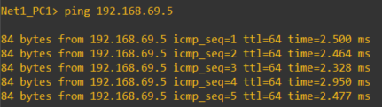

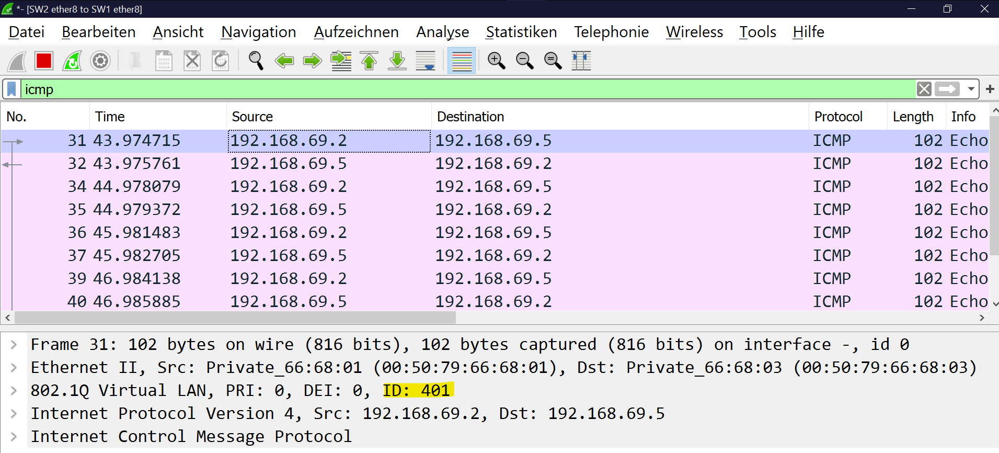

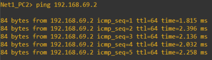

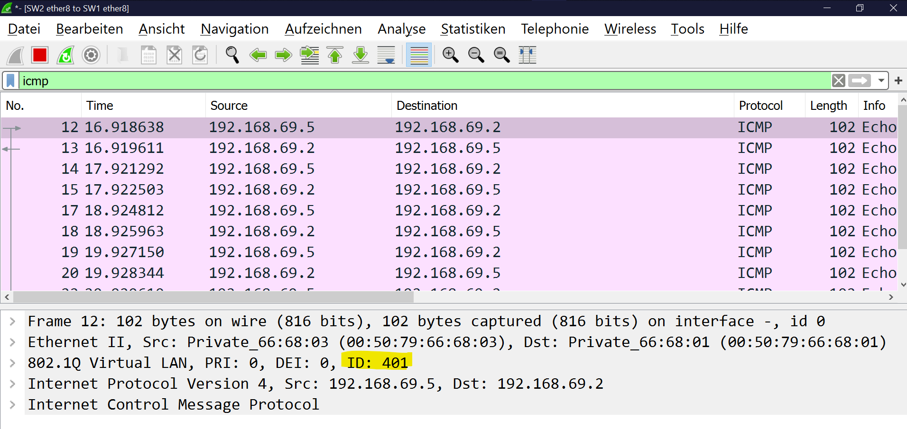

#### PC2 kann PC5 anpingen (und umgekehrt).

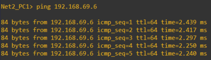

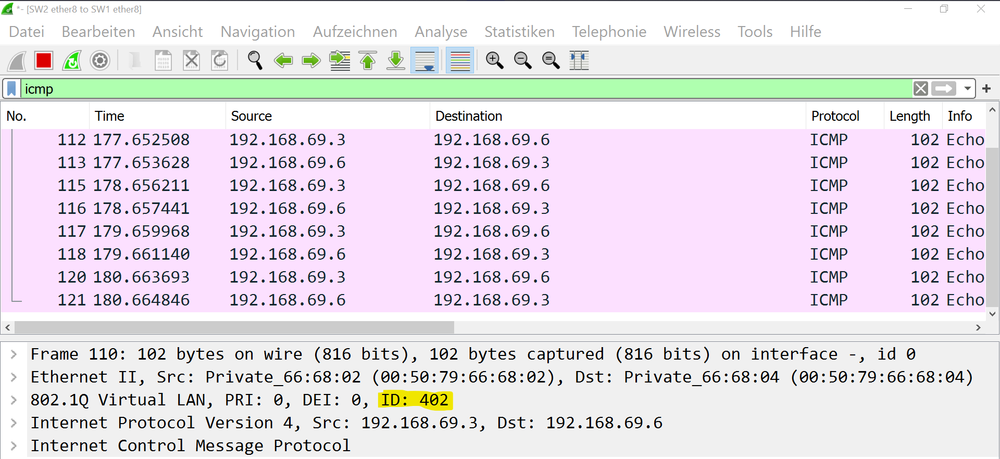

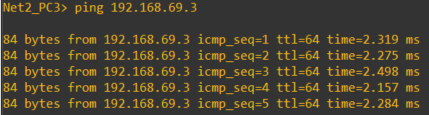

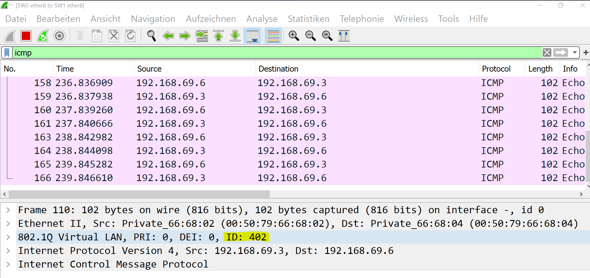

#### PC3 kann PC6 anpingen (und umgekehrt).

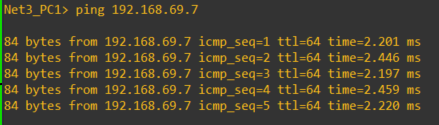

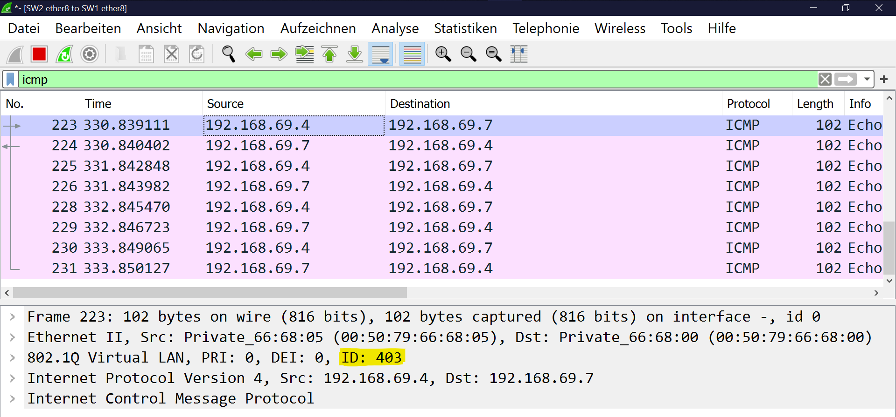

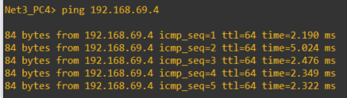

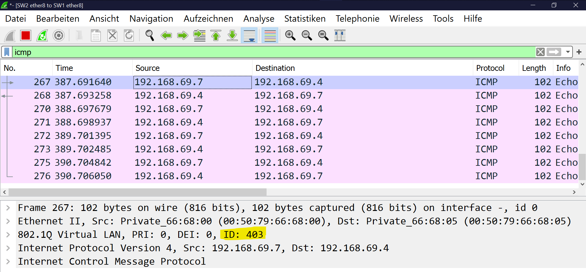

#### PC1 kann PC2 **nicht** anpingen (und umgekehrt).

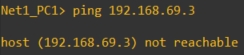

Keine ICMP Pakete gecaptured

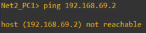

Keine ICMP Pakete gecaptured

#### PC2 kann PC4 **nicht** anpingen (und umgekehrt).

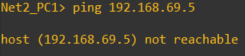

Keine ICMP Pakete gecaptured


Keine ICMP Pakete gecaptured

#### PC6 kann PC2 **nicht** anpingen (und umgekehrt).

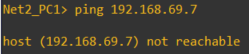

Keine ICMP Pakete gecaptured

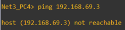

Keine ICMP Pakete gecaptured

## Config Export

## SW1

```bash
# jun/15/2021 15:55:27 by RouterOS 6.47
# software id =
#
#
#
/interface bridge
add name=bridge1 vlan-filtering=yes
/interface ethernet
set [ find default-name=ether1 ] disable-running-check=no
set [ find default-name=ether2 ] disable-running-check=no
set [ find default-name=ether3 ] disable-running-check=no
set [ find default-name=ether4 ] disable-running-check=no
set [ find default-name=ether5 ] disable-running-check=no
set [ find default-name=ether6 ] disable-running-check=no
set [ find default-name=ether7 ] disable-running-check=no
set [ find default-name=ether8 ] disable-running-check=no
/interface wireless security-profiles
set [ find default=yes ] supplicant-identity=MikroTik
/interface bridge port
add bridge=bridge1 frame-types=admit-only-untagged-and-priority-tagged interface=ether4 pvid=401
add bridge=bridge1 frame-types=admit-only-untagged-and-priority-tagged interface=ether5 pvid=402
add bridge=bridge1 frame-types=admit-only-untagged-and-priority-tagged interface=ether6 pvid=403
add bridge=bridge1 frame-types=admit-only-vlan-tagged interface=ether8
/interface bridge vlan
add bridge=bridge1 tagged=ether8 untagged=ether4 vlan-ids=401
add bridge=bridge1 tagged=ether8 untagged=ether5 vlan-ids=402
add bridge=bridge1 tagged=ether8 untagged=ether6 vlan-ids=403
/ip dhcp-client
add disabled=no interface=ether1
```

## SW2

```bash
# jun/15/2021 15:57:01 by RouterOS 6.47
# software id =
#
#
#
/interface bridge
add name=bridge1 vlan-filtering=yes
/interface ethernet
set [ find default-name=ether1 ] disable-running-check=no
set [ find default-name=ether2 ] disable-running-check=no
set [ find default-name=ether3 ] disable-running-check=no
set [ find default-name=ether4 ] disable-running-check=no
set [ find default-name=ether5 ] disable-running-check=no
set [ find default-name=ether6 ] disable-running-check=no
set [ find default-name=ether7 ] disable-running-check=no
set [ find default-name=ether8 ] disable-running-check=no
/interface wireless security-profiles
set [ find default=yes ] supplicant-identity=MikroTik
/ip pool
add name=dhcp_pool0 ranges=192.168.69.2-192.168.69.254
/interface bridge port
add bridge=bridge1 frame-types=admit-only-untagged-and-priority-tagged \
    interface=ether4 pvid=401
add bridge=bridge1 frame-types=admit-only-untagged-and-priority-tagged \
    interface=ether5 pvid=402
add bridge=bridge1 frame-types=admit-only-untagged-and-priority-tagged \
    interface=ether6 pvid=403
add bridge=bridge1 frame-types=admit-only-vlan-tagged interface=ether8
/interface bridge vlan
add bridge=bridge1 tagged=ether8 untagged=ether4 vlan-ids=401
add bridge=bridge1 tagged=ether8 untagged=ether5 vlan-ids=402
add bridge=bridge1 tagged=ether8 untagged=ether6 vlan-ids=403
/ip dhcp-client
add disabled=no interface=ether1
/ip dhcp-server network
add address=192.168.69.0/24 gateway=192.168.69.1
```

