# Aufgabe_05

## Aufgabenstellung

- Verbinden Sie mit einem Ethernet-Kabel einen Laptop der Gruppe mit dem Access Point, geben Sie sich eine statische IP Adresse aus dem Subnet *172.16.92.0/24* und rufen das Webinterface des Gerätes auf (172.16.92.51).
- Versuchen Sie folgende Fragen zu Ihrem Gerät zu beantworten:

  1. Welcher Hardware-Typ hat ihr WLAN interface (Marke + Modellnummer)?
  2. Welche Frequenzbänder unterstützt(en) ihr(e) WLAN interface(s)?
  3. Wie viele physischen WLAN interfaces sind auf ihrem Gerät vorhanden?
  4. Was für ein Typ Antenne besitzt ihr Gerät?

  1.  
- Aktivieren Sie ihr WLAN interface.
- Scannen Sie mithilfe der Funktion *Scan* des WLAN interfaces das 2.4 GHz Frequenzband ab. Welche Kanäle sind belegt? Verwenden Sie einen WLAN Kanalscanner auf einem Handy oder Laptop. Stellen Sie unterschiede fest?
- Wenn Ihr Gerät 5GHz fähig ist, machen Sie das gleiche für dieses Frequenzband.
- Gibt es hier an der TBZ Access Points, die sich nicht an die optimale Aufteilung auf die Kanäle 1,6,11 halten?
- ügen Sie unter /interface wireless channels für das 2.4GHz Band die drei Kanäle 1,6 und 11 in eine Channel-Liste mit dem Namen *«2.4GHz Channels»* ein.
- Fügen Sie unter /interface wireless channels für das 5GHz Band drei **nicht** **DFS** Kanäle in eine Channel-Liste mit dem namen *«5GHz Channels»* ein.
- Setzen im *Default Security Profile* die Passphrase auf EnteEnteEnte und aktivieren Sie **nur** WPA2.
- Beantworten Sie in Ihrem Laborbericht die Frage, weshalb Sie **WPA** nicht aktivieren sollten.
- Setzen Sie die SSID. Verwenden Sie dazu den Namen Gruppe5:
  Nach dem obligaten Teil dürfen Sie natürlich einen beliebigen Freitext einfügen.
- Wählen Sie für Ihr 2.4 GHz WLAN interface einen vorkonfigurieren *Channel* aus. Koordinieren Sie an der Wandtafel den Kanal. Ziel ist es, dass nicht alle Gruppen den gleichen Kanal verwenden.
- Versuchen Sie sich mit Ihrem Access Point zu verbinden.
   Sehen Sie die SSID?
   Erhalten Sie eine IP-Adresse?
   Dokumentieren Sie Ihre Erkenntnisse im Laborbericht.
- Prüfen Sie mit welcher TX Geschwindigkeit Sie mit dem Access Point verbunden sind. (Screenshot!)
- Beantworten Sie folgende Frage in Ihrem Laborbericht:
   Wie viele Kanäle verwenden Sie? (Laborbericht)
- Versuchen Sie den Access Point so zu konfigurieren, dass Sie zwei Kanäle verwenden.
- Prüfen Sie nochmals Ihre TX Geschwindigkeit.
   Was stellen Sie fest? Notieren Sie Ihre Feststellungen mit Screenshots in Ihrem Laborbericht.
- Fügen Sie ein tagged VLAN interface (VLAN-ID 145) auf einem freien Ethernet Port hinzu.
- Erstellen Sie ein virtuelles WLAN interface mit der SSID wie oben, aber fügen Sie zu beginn noch «Client» ein.
- Erstellen Sie eine virtuelle Bridge und fügen Sie beiden interfaces der vorhergehenden Schritte dieser hinzu.
- Verbinden Sie Ihren Access Point mit dem zentralen Switch.
- Verbinden Sie sich nun mit einem Laptop mit diesem neuen WLAN.
   Erhalten Sie eine IP-Adresse?
   Können Sie sich mit dem Internet verbinden?
   ( Notieren im Laborbericht inkl. Screenshots)
- Wenn Sie nun eine IP Adresse erhalten haben und Zugriff auf das Internet haben sind Sie Fertig .

## Ziele

- Sie können ein sicheres WLAN auf einem WLAN fähigen MikroTik Router konfigurieren
- Sie können mehrere SSIDs auf einem physischen WLAN interface aufschalten.
- Sie können den richtigen Kanal für Ihren Access Point konfigurieren.

## Parameter


## Lösungen / Dokumentation

### Interface Informationen

| Frage          | Antwort                       |
| -------------- | ----------------------------- |
| Hardware-Typ   | Intel(R) Wi-Fi 6 AX200 160MHz |
| Frequenzbänder | 2.4GHz, 5GHz                  |
| Anzahl         | 1                             |
| Antenne        | 2x2                           |


### Unterschied Scan AP und Smartphone 2.4 GHz

Die Kanäle 1, 6 und 11 sind besetzt. 
Auf dem AP sind viel mehr WLANs zu sehen.
Wir haben dies herausgefunden, indem wir die Frequenzen angeschaut haben. 


### Unterschied Scan AP und Smartphone 5 GHz

Hier sind die Kanäle 36, 38, 48, zwischen 100 - 116 und zwischen 149 - 160. 
Wir haben dies herausgefunden, indem wir die Frequenzen angeschaut haben. Dazu konnten wir feststellen, dass  es ein Frequenzloch zischen den Kanälen 52 und 100 gibt. Wenn ich nun ein 5GHz WLAN einrichten wollen würde, würde ich ein Kanal in diesem Bereich nehmen.


### Halten sich die TBZ APs an die Kanäle 1, 6, 11?

Wir konnten keine APs finden, welche sich nicht an diese Kanäle halten. Deshalb würde ich sagen, dass sich die TBZ APs an diese Kanäle halten. 

## Mikrotik konfigurieren

### Channels hinzufügen

Unter Wireless> Channels > Add New

#### 2.4GHz

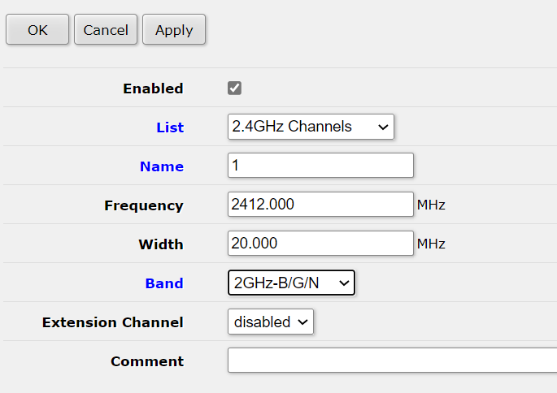

Konfiguration entsprechen [Parameter](#Parameter)

#### 5.0GHz

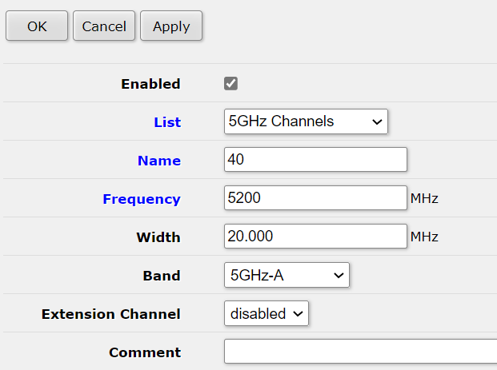

Konfiguration entsprechend [Parameter](#Parameter)

### Interfaces Konfigurieren

Unter Wireless > WiFi Interfaces

#### wlan1 > Wireless

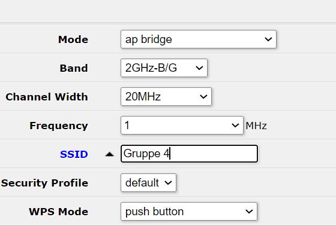

#### wlan2 > Wireless

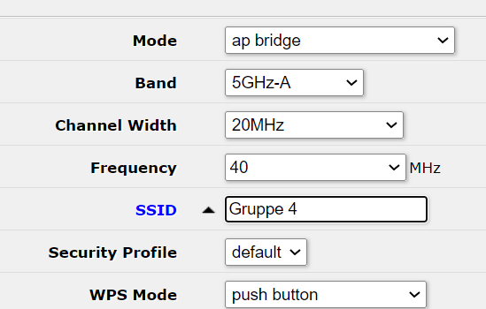

### Überprüfung

SSID wird angezeigt

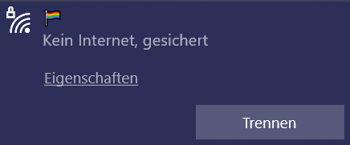

Wir erhalten keine bzw. eine APIPA Adresse

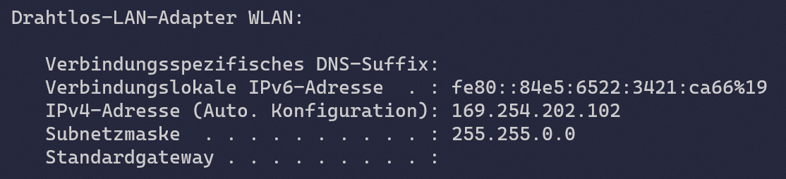

Die Verbindungsgeschwindigkeit beträgt 144/144(Mbps)


Es wird pro Band (2.4 und 5.0) je ein Channel benutzt

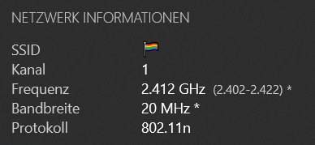


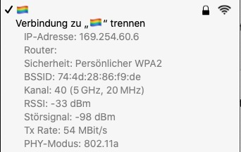

### Mehrere channels

unter Wireless > Channels > Channel mit name 1 > Extension channel zu Ce ändern

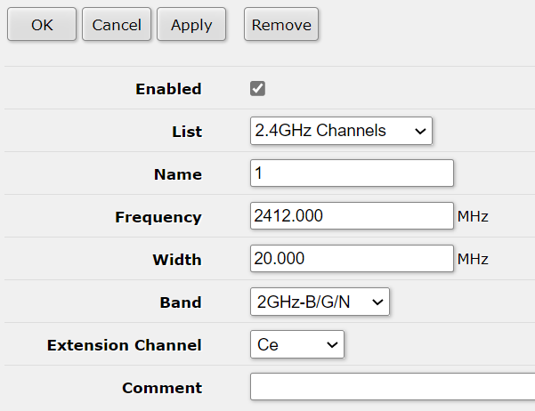


### Vlan einrichten

Unter Interfaces > Interface > Add New

#### VLAN

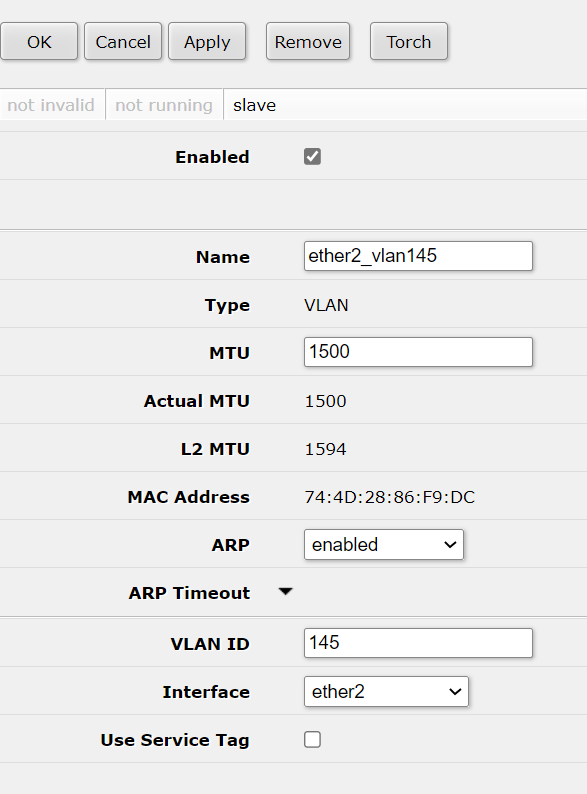

#### Virtual

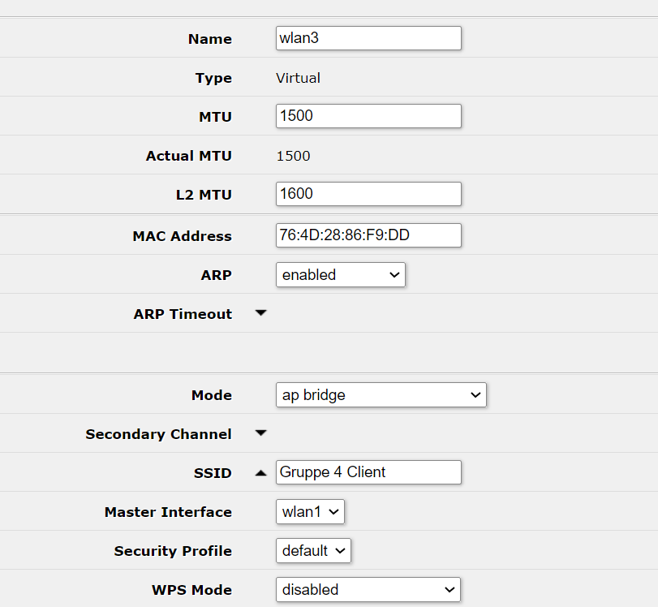

#### Bridge > Add New

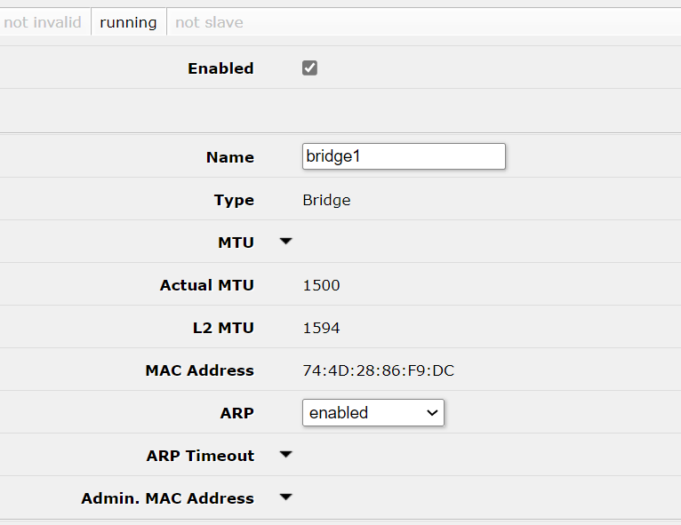

#### > Ports > Add New

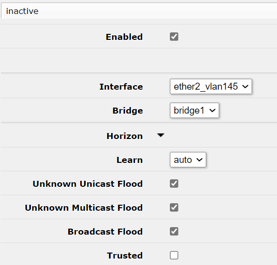

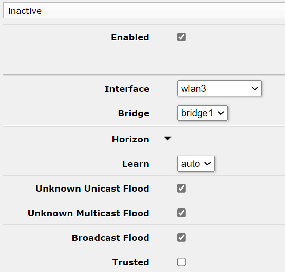

#### Überprüfung

Wir sehen die SSID


Wir habe eine IP-Adresse erhalten

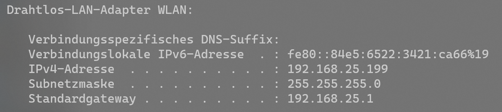

## Export

```bash
# jun/16/2021 21:07:39 by RouterOS 6.48.3
# software id = BVUU-GTSJ
#
# model = RBcAPGi-5acD2nD
# serial number = B9320AC905FA
/interface bridge
add name=bridge1
/interface ethernet
set [ find default-name=ether2 ] poe-out=off
/interface vlan
add interface=ether2 name=ether2_vlan145 vlan-id=145
/interface wireless channels
add band=2ghz-b/g/n extension-channel=Ce frequency=2412 list="2.4GHz Channels" name=1 width=20
add band=2ghz-b/g/n frequency=2437 list="2.4GHz Channels" name=6 width=20
add band=2ghz-b/g/n frequency=2462 list="2.4GHz Channels" name=11 width=20
add frequency=5160 list="5GHz Channels" name=32 width=20
add frequency=5180 list="5GHz Channels" name=36 width=20
add frequency=5200 list="5GHz Channels" name=40 width=20
/interface wireless
set [ find default-name=wlan1 ] disabled=no frequency=1 mode=ap-bridge ssid="\F0\9F\8F\B3\EF\B8\8F\E2\80\8D\F0\9F\8C\88"
set [ find default-name=wlan2 ] disabled=no frequency=40 mode=ap-bridge ssid="\F0\9F\8F\B3\EF\B8\8F\E2\80\8D\F0\9F\8C\88"
add disabled=no mac-address=76:4D:28:86:F9:DD master-interface=wlan1 name=wlan3 ssid="Gruppe 4 Client" wds-default-bridge=bridge1 wps-mode=disabled
/interface wireless security-profiles
set [ find default=yes ] authentication-types=wpa2-psk group-ciphers=tkip,aes-ccm mode=dynamic-keys supplicant-identity=MikroTik unicast-ciphers=tkip,aes-ccm wpa-pre-shared-key=12345678 \
    wpa2-pre-shared-key=EnteEnteEnte
/user group
set full policy=local,telnet,ssh,ftp,reboot,read,write,policy,test,winbox,password,web,sniff,sensitive,api,romon,dude,tikapp
/interface bridge port
add bridge=bridge1 interface=ether2_vlan145
add bridge=bridge1 interface=wlan3
/ip neighbor discovery-settings
set discover-interface-list=!dynamic
/ip address
add address=172.16.92.51/24 comment="Default (DO NOT REMOVE)" interface=ether1 network=172.16.92.0
/ip dhcp-client
add disabled=no interface=ether2
/ip ssh
set forwarding-enabled=remote
/system clock
set time-zone-name=Europe/Zurich
/system routerboard mode-button
set enabled=yes on-event=dark-mode
/system script
add comment=defconf dont-require-permissions=no name=dark-mode owner=*sys policy=ftp,reboot,read,write,policy,test,password,sniff,sensitive,romon source="\r\
    \n   :if ([system leds settings get all-leds-off] = \"never\") do={\r\
    \n     /system leds settings set all-leds-off=immediate \r\
    \n   } else={\r\
    \n     /system leds settings set all-leds-off=never \r\
    \n   }\r\
    \n "
```


