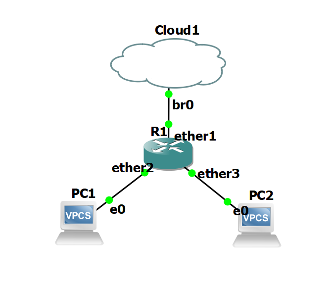
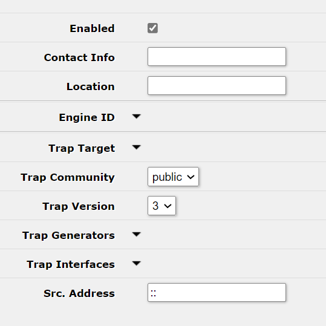
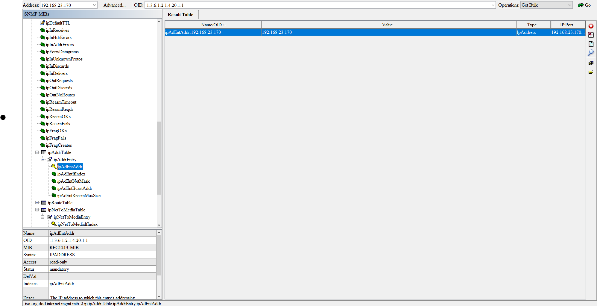
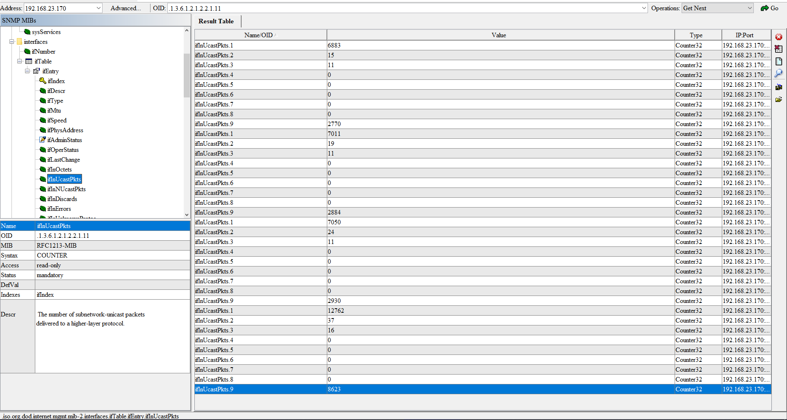
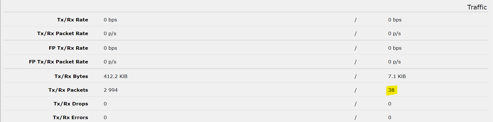

# Aufgabe 06  MIB Browser

## GNS3



Auf den PCs jeweils Ip-Adresse vom dhcp erhalten mit:

```bash
ip dhcp
```

## SNMP Aktivieren

Im webfig von Mikrotik IP > SNMP:



## ipAdEntAddr



Der wert entspricht der IP-Adresse des Routers(192.168.23.170). Der wert ist read-only.

## ifInUcastPkts.2



Dies sind die eintreffenden Unicast Packete auf Port 2. Der Wert kann z.B. durch das Pingen des Routers von PC1 erhöht werden.

Dieser wert kann unter Webfig > Interfaces >  ether2 > Traffic gefunden werden:

